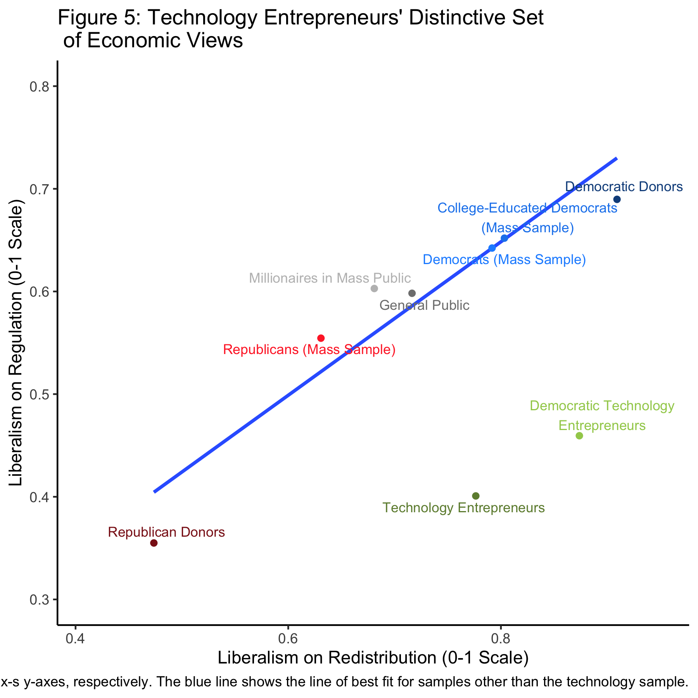

```{r setup, include=FALSE}
knitr::opts_chunk$set(echo = F, eval = T, cache = T)

library(cowplot)
library(ggrepel)
library(grid)
library(gridExtra)
library(haven)
library(kableExtra)
library(knitr)
library(labelled)
library(mice)
library(naniar)
library(plyr)
library(png)
library(reshape)
library(scales)
library(stargazer)
library(stringr)
library(tidyr)
library(tidyverse)

# First run 'tech-elites-paper/prep_data.R' to clean datasets

```


# Abstract^[All analysis for this paper is available at https://github.com/michgao87/gov1006-milestone6]

Broockman, Ferenstein, and Malhotra (2019) show that technology entrepreneurs have a unique set of political beliefs: they are liberal on social issues, globalism, and redistribution, but very conservative on government regulation. The replication of almost all the models succeeded. An extension looking into treating missing data more rigorously returned some differences in a model. Analyzing technology elites' political beliefs is an increasingly timely task as the technology industry becomes more influential in politics.

# Introduction

Broockman, Ferenstein, and Malhotra (2019) seek to disprove the assumption that economic elites are homogenous and that increases in their political power necessarily increases inequality across the board—specifically, they focus on describing the political behavior of technology elites, who are growing increasingly wealthy and politically influential. They use four original surveys—of technology entrepreneurs in which the modal respondent is a millionaire who founded or runs a tech industry company with around 100 employees; of partisan donors with an oversample of top 1\% donors; and subsamples of wealthy individuals and partisans in the mass public from Survey Sampling International. Throughout the paper, they compare the political beliefs of technology entrepreneurs to these other groups. They demonstrate that technology entrepreneurs support liberal redistributive, social, and globalist policies, but conservative regulatory policies. This is a unique bundle among other economic elites that the authors speculate stem from technology entrepreneurs’ unique predispositions. Technology entrepreneurs believe more strongly in markets and entrepreneurship than general Democrats and large Democratic donors—they are more opposed than Democrats to regulation regardless of the industry and generally prefer private to public-sector management. Uniquely among groups, they support redistribution but oppose regulation. Thus, despite some popular belief, they are not very likely to be libertarians. Furthermore, the authors compared the results of entrepreneurs to Stanford CS and biology majors to show that these political predispositions are apparent in STEM undergraduates before they enter the tech workforce. Like the general public, economic elites’ political views stem from values and predispositions, and if similar-minded people tend to cluster in similar industries, views of elites can be distinguished among industries. The authors surmise that their findings provide evidence of looming changes in the Democratic Party, since technology elites are have the financial means to influence candidates but are opposed to many government interventions that have been the standard Democratic answer to inequality and receive support from traditionally Democratic interest groups such as unions.

# Literature Review

There is very little literature available on the political beliefs of members of the technology industry. Much research in this area has been conducted by the authors themselves. Of particular interest is Ferenstein's ["The Age of Optimists"](https://medium.com/the-ferenstein-wire/silicon-valley-s-political-endgame-summarized-1f395785f3c1)

# Replication

There is one linear regression model that I was unable to replicate fully. In Table 6: "Technology Entrepreneurs No More Likely to Oppose Regulating Technology Products Than Democratic Groups," my linear regression contains the wrong coefficients relating to the "tech product/service" indicator variable. 

# Extension

My extension is to handle missing data using multiple imputation via the mice package in R. I noticed that there were often sizable proportions of missing data for many variables used in the research. The original authors omitted the missing data when running their regressions, as did I when replicating their work. However, I wondered how handling the missingness might change the results. Because there were multiple models run in the paper, I chose only one to extend using multiple imputation for the missing data. The model I found most interesting was regressing views towards government intervention in the economy, private sector management, and opinion of entrpreneurs by group (tech entrepreneur, Democratic and Republican donors, and Democratic and Republican mass public).

According to Rubin (1976)'s classification, there are three types of missing data: Missing Completely at Random, Missing at Random, and Missing Not at Random. MNAR is extremely problematic, as it implies that there are unobservable characteristics driving the observed phenomena. MCAR is ideal because it would not affect the results but is generally unrealistic. Assuming MAR, multiple imputation is a possible solution. Multiple imputation is a procedure that substitutes missing values using an appropriate model that includes random variation; creates independent imputed datasets; and calculates the final parameter estimates as the average of the estimates across each of those datasets. The new standard errors must also take into account the uncertainty generated by the multiple imputed datasets.  The mice package in R uses Conditional Multiple Imputation, which models a variable's conditional distribution on the other variables (rather than assuming one distribution for the entire dataset).

```{r extension, warning = F, message = F}
ext <- read_dta("tech-elites-paper/Tech Donor and Public Survey Data/combined_withmeans_anon.dta") %>% 
  mutate(
    sampletext = case_when(
      sample == 3 ~ "Tech",
      sample == 1 & (pid1 == 1 | pid2leanselectedchoice == 1) ~ "Democrats (Mass Public)",
      sample == 1 & (pid1 == 2 | pid2leanselectedchoice == 2) ~ "Republicans (Mass Public)",
      sample == 2 & party == "D" ~ "Democratic Donors",
      sample == 2 & party == "R" ~ "Republican Donors",
      T ~ NA_character_),
    sampletext = factor(sampletext, 
                        levels = c("Tech", "Democratic Donors", "Democrats (Mass Public)",
                                   "Republican Donors", "Republicans (Mass Public)",
                                   NA_character_)),
    govruns = 1 - govruns,
    pref_for_private = 4 * (privatesectorruns - govruns),
    gov_goodjob = 4 - 3*gov_goodjob,
    entrepreneurstoomuchcredit = 4 - 3*entrepreneurstoomuchcredit) %>%
  select(sampletext, govruns, pref_for_private, gov_goodjob, entrepreneurstoomuchcredit)
missing_table <- miss_var_summary(ext)

missing_table %>% 
  mutate(pct_miss = round(pct_miss, 2)) %>% 
  mutate_all(linebreak) %>%
   kable("pandoc", booktabs = T, escape = F, align = "c",
         caption = "Missing Data",
         col.names = c("Variable", "# Missing", "% Missing")) 

imp <- mice(ext, print = F)

ext_long <- complete(imp, action = "long", include = T) %>% as_tibble()
  
private_reg_imp <- with(ext_long, lm(pref_for_private ~ sampletext))
gov_reg_imp <- with(ext_long, lm(gov_goodjob ~ sampletext))
entre_reg_imp <- with(ext_long, lm(entrepreneurstoomuchcredit ~ sampletext))


# Table 7: original regression
survey <- read_dta("tech-elites-paper/Tech Donor and Public Survey Data/combined_withmeans_anon.dta") %>% 
  mutate(
    sampletext = case_when(
      sample == 3 ~ "Tech",
      sample == 1 & (pid1 == 1 | pid2leanselectedchoice == 1) ~ "Democrats (Mass Public)",
      sample == 1 & (pid1 == 2 | pid2leanselectedchoice == 2) ~ "Republicans (Mass Public)",
      sample == 2 & party == "D" ~ "Democratic Donors",
      sample == 2 & party == "R" ~ "Republican Donors"),
    sampletext = factor(sampletext, 
                        levels = c("Tech", "Democratic Donors", "Democrats (Mass Public)",
                                   "Republican Donors", "Republicans (Mass Public)")),
    govruns = 1 - govruns,
    pref_for_private = 4 * (privatesectorruns - govruns),
    gov_goodjob = 4 - 3*gov_goodjob,
    entrepreneurstoomuchcredit = 4 - 3*entrepreneurstoomuchcredit
  )

private_reg <- lm(pref_for_private ~ sampletext, data = survey)
gov_reg <- lm(gov_goodjob ~ sampletext, data = survey)
entre_reg <- lm(entrepreneurstoomuchcredit ~ sampletext, data = survey)
```

```{r extension_output, results = "asis"}
stargazer(private_reg_imp, private_reg, gov_reg_imp, gov_reg, entre_reg_imp, entre_reg, 
          type = "latex", header = F, no.space = T, notes.align = "l", digits = 2,
          keep.stat = c("n", "rsq"),
          covariate.labels = c("Dem. Donors",
                               "Dem. (Mass Public)",
                               "Rep. Donors",
                               "Rep. (Mass Public)",
                               "\\shortstack{Constant \\\\ (Tech Entrepeneurs)}"),
          model.numbers = F,
          column.labels = c("\\shortstack{Approval of Privately Run Programs (1–5)\\\\ Minus Approval of Govt-Run \\\\ Social Programs (1–5)}", "\\shortstack{Govt Does Good Job \\\\ Running Social \\\\ Programs (1–4)}", "\\shortstack{Entrepreneurs Get Too \\\\ Much Credit (1–4)}"),
          column.separate = c(2, 2, 2),
          #dep.var.labels = c("", "", ""),
          dep.var.caption = "",
          table.layout = "=c-!ts-n",
          title = "Extension: Regression With and Without Imputed Data"
)
```

This table shows that the regression results with the imputed data are slightly different than the original results without. Though all the coefficients are slightly different, all the significances are identical except one: the coefficient for Republican Donors on the question of "Entrepreneurs get too much credit" is significant in the extension, but was originally insignificant. However, the actual difference in the coefficient is just 0.01. Here you can see the influence of having somewhat arbitrary p-value cut-offs. The standard error for the coefficient using the imputed data is much lower than the standard error with the missing data that was omitted. Nevertheless, the overall finding for that column, which is that tech entrepreneurs have beliefs on entrepreneurship most similar to Republican donors, still holds, since the Republican donor coefficient is so much lower than the coefficient for other subgroups. 

As for implications for the other models in the paper, it seems that this multiple implication procedure may tend to make variables appear significant even if they did not appear that way with the missing data omitted. The more interesting question remains, is Missing At Random a reasonable assumption for this data?  

# Appendix

Below are replicated figures and tables in the order they appear in the paper. I did not replicate text-only tables.  

Milestone 5 Graphic: I included a caption for Figure 4, "Average of Policy Indices by Area." Since I replicated all figures, I put them all here in the Appendix, but that would be considered my graphic from Milestone 5.    

```{r fig1, message = F, warning = F}

# Forbes 400 dataset

f400 <- read_dta("tech-elites-paper/Other Data/f400_wtech.dta") 

# Open Secrets donation dataset
opensecrets <- read_dta("tech-elites-paper/Other Data/opensecrets.dta") %>% 
  mutate(d_share = d_donations / (d_donations + r_donations))

# Figure 1a
fig_1a <- f400 %>% 
  filter(in400 == 1) %>% 
  group_by(year) %>% 
  dplyr::summarise(tech_prop = sum(tech) / n()) %>% 
  ggplot(aes(x = year, y = tech_prop)) +
    geom_line(col = "dark green") +
    labs(title = "Share of Forbes 400 Who Are in Tech Industry, by Year",
         y = "Share", x = "Year",
         caption = "Source: Bonica and Rosenthal (2015)") 
ggsave('figures/1a.png', fig_1a, width = 5.5)

# Figure 1b
fig_1b <- ggplot(opensecrets, aes(x = year, y = d_share)) +
  geom_line(col = "dark green") + 
  geom_hline(yintercept = .5, col = "dark red") +
  labs(title = "Share of Contributions Going to Democrats from All Those \n Working for Tech Companies, by Year",
       y = "$ Millions", x = "Year",
       caption = "Source: Opensecrets")
ggsave('figures/1b.png', fig_1b, width = 5.5)

# Figure 1c
fig_1c <- f400 %>% 
  filter(tech == 1) %>% 
  group_by(year) %>% 
  dplyr::summarise(tot_amount_dem = sum(tot_amount_dem),
                   tot_amount_rep = sum(tot_amount_rep)) %>% 
  mutate(d_donations_share = tot_amount_dem / (tot_amount_dem + tot_amount_rep)) %>% 
  ggplot(aes(x = year, y = d_donations_share)) +
    geom_line(col = "dark green") + 
    geom_hline(yintercept = .5, col = "dark red") +
    labs(title = "Share of Contributions Going to Democrats from \n Those In Tech and Ever in Forbes 400, by Year",
         y = "Share", x = "Year",
         caption = "Source: Bonica and Rosenthal (2015)")
ggsave('figures/1c.png', fig_1c, width = 5.5)

# Figure 1d
fig_1d <- ggplot(opensecrets, aes(x = year, y = d_donations)) +
  geom_line(col = "dark green") + 
  labs(title = "Total Contributions to Democrats from All Those \n Working for Tech Companies, by Year",
       y = "$ Millions", x = "Year",
       caption = "Source: Opensecrets") 
ggsave('figures/1d.png', fig_1d, width = 5.5)

# Figure 1e
fig_1e <- f400 %>% 
  filter(tech == 1) %>% 
  group_by(year) %>% 
  dplyr::summarise(tot_amount_dem = sum(tot_amount_dem),
                   tot_amount_rep = sum(tot_amount_rep)) %>% 
  mutate(d_donations_share = tot_amount_dem / (tot_amount_dem + tot_amount_rep),
         tot_amount_dem_millions = tot_amount_dem / 1000000) %>% 
  ggplot(aes(x = year, y = tot_amount_dem_millions)) +
    geom_line(col = "dark green") +
    labs(title = "Total Contributions to Democrats from Those \n In Tech and Ever in Forbes 400, by Year",
         y = "Share", x = "Year",
         caption = "Source: Bonica and Rosenthal (2015)") 
ggsave('figures/1e.png', fig_1e, width = 5.5)

fig_1a <- readPNG('figures/1a.png')
fig_1b <- readPNG('figures/1b.png')
fig_1c <- readPNG('figures/1c.png')
fig_1d <- readPNG('figures/1d.png')
fig_1e <- readPNG('figures/1e.png')

grid.arrange(rasterGrob(fig_1a, width = unit(0.75,"npc"), height = unit(1,"npc")),
             rasterGrob(fig_1b, width = unit(0.75,"npc"), height = unit(1,"npc")),
             rasterGrob(fig_1c, width = unit(0.75,"npc"), height = unit(1,"npc")),
             rasterGrob(fig_1d, width = unit(0.75,"npc"), height = unit(1,"npc")),
             rasterGrob(fig_1e, width = unit(0.75,"npc"), height = unit(1,"npc")),
             widths = c(1,1,1,1), 
             layout_matrix = rbind(c(NA, 1, 1, NA), c(2,2,3,3), c(4,4,5,5)),
             top = "Figure 1: Technology Entrepreneurs' Wealth Is Growing, \n and They Increasingly Contribute It to Democrats")
# grid.arrange(
#              rasterGrob(fig_1b), rasterGrob(fig_1c),
#              rasterGrob(fig_1d), rasterGrob(fig_1e), ncol = 2,
#              top = "Figure 1: Technology Entrepreneurs' Wealth Is Growing, \n and They Increasingly Contribute It to Democrats")
```


```{r fig2, message = F, warning = F}

data <- read_dta('tech-elites-paper/Tech Donor and Public Survey Data/combined_anon.dta')
data <- subset(data, sample == 2) # Subset to donor sample.

deminf <- data[,startsWith(names(data), 'deminf')]
deminf.more <- deminf == 1
deminf.less <- deminf == 3

df <- data.frame(colMeans(deminf.less, na.rm = TRUE))
names(df) <- 'Less'
df$group <- rownames(df)
df$group[df$group == 'deminfluence_tech'] <- 'Technology entrepreneurs'
df$group[df$group == 'deminfluence_smallbiz'] <- 'Small businesses'
df$group[df$group == 'deminfluence_bigbiz'] <- 'Big businesses'
df$group[df$group == 'deminfluence_labor'] <- 'Labor unions'
df$group[df$group == 'deminfluence_lgbt'] <- 'LGBT people and organizations'
df$group[df$group == 'deminfluence_banks'] <- 'Big banks'
df$group[df$group == 'deminfluence_civilrights'] <- 'Civil rights organizations'
df$group[df$group == 'deminfluence_blacks'] <- 'African-Americans'
df$group[df$group == 'deminfluence_latinos'] <- 'Latinos'
df <- df[order(df$Less),]
df$group <- factor(df$group, ordered = TRUE, levels = df$group)

less <- ggplot(df) + geom_col(aes(x = group, y = Less)) + coord_flip() + 
  xlab('') + ylab('') + 
  labs(title = "Share of Democratic Donors Expecting Below\nGroup's Influence in Party to Decrease") +
  scale_y_continuous(labels=scales::percent) +
  theme(plot.title = element_text(size = 10))
ggsave('figures/donors_think_lessinf.png', less, width = 5.5)

df <- data.frame(colMeans(deminf.more, na.rm = TRUE))
names(df) <- 'More'
df$group <- rownames(df)
df$group[df$group == 'deminfluence_tech'] <- 'Technology entrepreneurs'
df$group[df$group == 'deminfluence_smallbiz'] <- 'Small businesses'
df$group[df$group == 'deminfluence_bigbiz'] <- 'Big businesses'
df$group[df$group == 'deminfluence_labor'] <- 'Labor unions'
df$group[df$group == 'deminfluence_lgbt'] <- 'LGBT people and organizations'
df$group[df$group == 'deminfluence_banks'] <- 'Big banks'
df$group[df$group == 'deminfluence_civilrights'] <- 'Civil rights organizations'
df$group[df$group == 'deminfluence_blacks'] <- 'African-Americans'
df$group[df$group == 'deminfluence_latinos'] <- 'Latinos'
df <- df[order(df$More, decreasing = TRUE),]
df$group <- factor(df$group, ordered = TRUE, levels = df$group)

more <- ggplot(df) + geom_col(aes(x = group, y = More)) + coord_flip() + 
  xlab('') + ylab('') + 
  ggtitle('Share of Democratic Donors Expecting Below\nGroup\'s Influence in Party to Increase') +
  scale_y_continuous(labels=scales::percent) +
  theme(plot.title = element_text(size = 10))
ggsave('figures/donors_think_moreinf.png', more, width = 5.5)

fig_2a <- readPNG('figures/donors_think_moreinf.png')
fig_2b <- readPNG('figures/donors_think_lessinf.png')
grid.arrange(rasterGrob(fig_2a), rasterGrob(fig_2b), nrow = 1,
             top = textGrob("Figure 2: Democratic Donors' Forecasts of Groups \n That Will Gain and Lose Influence in the Party", vjust = 2))

```

```{r fig3, message = F, warning = F}
data <- read_dta('tech-elites-paper/Tech Donor and Public Survey Data/combined_anon.dta')
data <- subset(data, sample == 3) 

maxemployees <- ggplot(subset(data, !is.na(maxpeopleworkedunderr)),
       aes(x=to_factor(maxpeopleworkedunderr))) + 
  geom_bar(aes(y = (..count..)/sum(..count..))) +
  xlab('Max Employees Worked For Respondent') + ylab('Percentage') + scale_y_continuous(labels=scales::percent)
ggsave('figures/maxemployees.png', maxemployees, scale = .6)

millionaire <- ggplot(subset(data, !is.na(millionaire)),
       aes(x = to_factor(millionaire))) +
  geom_bar(aes(y = (..count..)/sum(..count..))) +
  xlab('Millionaire?') + ylab('Percentage') + scale_y_continuous(labels=scales::percent)
ggsave('figures/millionaire.png', millionaire, scale = .6)

topposition <- ggplot(subset(data, !is.na(topposition)),
       aes(x=to_factor(topposition))) + 
  geom_bar(aes(y = (..count..)/sum(..count..))) +
  xlab("Respondent's Top Position Held") + ylab('Percentage') + scale_y_continuous(labels=scales::percent)
ggsave('figures/topposition.png', topposition, scale = .6)

startedorrunbiz <- ggplot(subset(data, !is.na(startedorrunbusiness)),
       aes(x=to_factor(startedorrunbusiness))) + 
  geom_bar(aes(y = (..count..)/sum(..count..))) +
  xlab('Started or Run a Business?') + ylab('Percentage') + scale_y_continuous(labels=scales::percent)
ggsave('figures/startedorrunbiz.png', startedorrunbiz, scale = .6)

worksintech <- ggplot(subset(data, !is.na(worksintech)),
       aes(x=to_factor(worksintech))) + 
  geom_bar(aes(y = (..count..)/sum(..count..))) +
  xlab('Works in Technology Industry?') + ylab('Percentage') + scale_y_continuous(labels=scales::percent)
ggsave('figures/worksintech.png', worksintech, scale = .6)

fig_3a <- readPNG("figures/maxemployees.png")
fig_3b <- readPNG("figures/millionaire.png")
fig_3c <- readPNG("figures/topposition.png")
fig_3d <- readPNG("figures/startedorrunbiz.png")
fig_3e <- readPNG("figures/worksintech.png")
grid.arrange(rasterGrob(fig_3a), rasterGrob(fig_3b), rasterGrob(fig_3c),
             rasterGrob(fig_3d), rasterGrob(fig_3e), nrow = 2,
             top = "Figure 3: Self-Reported Respondent Characteristics: Technology Entrepreneur Survey")

```

(ref:fig4) Figure 4 sums up the main finding of the paper -- technology entrepreneurs' distinctive bundle of policy views. Technology entrepreneurs have liberal views in many areas. On social issues, globalism, and redistribution, they are more supportive than the Democratic public, educated Democrats, and Democratic donors. Yet on the topic of regulation (the questions included "government regulation of business does more harm than good" and "regulate 'gig' workers like regular workers"), tech entrepreneurs were significantly less supportive than those same groups of Democrats.  On regulation, tech entrepreneurs actually resemble Republicans much more. 

```{r fig4, warning = F, message = F, fig.cap="(ref:fig4)"}
data <- read_dta('tech-elites-paper/Tech Donor and Public Survey Data/combined_withmeans_anon.dta')

data$medianvoter <- data$sample == 1
data$massdems <- data$sample == 1 & data$pid3 == 1
data$massreps <- data$sample == 1 & data$pid3 == 3
data$masseducdems <- data$massdems & data$education >= 4
data$donordems <- data$sample == 2 & data$party == 'D'
data$donorreps <- data$sample == 2 & data$party == 'R'
data$tech <- data$sample == 3
data$techdems <- data$sample == 3 & data$pid3 == 1
data$techreps <- data$sample == 3 & data$pid3 == 3
data$massmillionaires <- data$sample == 1 & data$millionaire == 1

get.data.subset <- function(filtered.df, group.name) {
  filtered.df$group <- group.name
  return(filtered.df)
}

data <- rbind.data.frame(get.data.subset(filter(data, medianvoter == 1), 'General Public'),
                         get.data.subset(filter(data, massdems == 1), 
                                         'Democrats (Mass Sample)'),
                         get.data.subset(filter(data, masseducdems == 1),
                                         'College-Educated Democrats (Mass Sample)'),
                         get.data.subset(filter(data, massreps == 1), 
                                         'Republicans (Mass Sample)'),
                         get.data.subset(filter(data, donordems == 1), 
                                         'Democratic Donors'),
                         get.data.subset(filter(data, donorreps == 1), 
                                         'Republican Donors'),
                         get.data.subset(filter(data, tech == 1), 
                                         'Technology Entrepreneurs'),
                         get.data.subset(filter(data, techdems == 1), 
                                         'Democratic Technology Entrepreneurs'))


data$group <- factor(data$group, ordered = TRUE,
                     levels = unique(data$group)[c(1,2,3,5,4,6,7,8)])

data$regulation <- 1 - data$regulation 

# for use in the next graph
d.copy <- data %>% 
  rbind.data.frame(get.data.subset(filter(data, massmillionaires == 1), 
                                   'Millionaires in Mass Public')) %>%
  group_by(group) %>% 
  summarize_each(funs(mean(., na.rm = TRUE), 
                      se = sd(., na.rm = TRUE) / sqrt(sum(!is.na(.)))),
                 redistribution, social, globalism, regulation) %>%
  data.frame()


# main analysis data
data <- filter(data, group != 'Democratic Technology Entrepreneurs')
data$group <- factor(data$group, ordered = TRUE,
                     levels = levels(data$group)[1:7])

d <- data %>% 
  group_by(group) %>% 
  summarize_each(funs(mean(., na.rm = TRUE), 
                      se = sd(., na.rm = TRUE) / sqrt(sum(!is.na(.)))),
                 redistribution, social, globalism, regulation) %>%
  data.frame()

d <- reshape(d, direction = 'long',
             varying = names(d)[-1],
             v.names = 'value',
             timevar = 'statname',
             times = names(d)[-1]) %>%
  separate(statname, c('construct', 'stat'), '_') %>%
  select(-id) %>%
  reshape(direction = 'wide',
          idvar = c('group', 'construct'),
          timevar = 'stat')

d$ebymax <- with(d, value.mean + value.se * 1.96)
d$ebymin <- with(d, value.mean - value.se * 1.96)

d$construct <- as.character(d$construct)
d$construct <- revalue(d$construct, c(globalism = 'Support for Globalism', 
                                      regulation = 'Support for Regulation',
                                      social = 'Liberalism on Social Issues', 
                                      redistribution = 'Support for Redistribution'))


g <- ggplot(data = d, aes(x = group)) +
  geom_col(aes(y = value.mean, fill = group)) + 
  scale_fill_manual(values = c('grey50',
                               'dodgerblue1', 'dodgerblue2', 'dodgerblue4',
                               'firebrick1', 'firebrick4', 
                               'darkolivegreen3')) +
  geom_errorbar(aes(ymax = ebymax, ymin = ebymin)) +
  ylab("Liberalism") + xlab("Group") + theme_bw() +
  facet_wrap(~construct, scales = 'free') +
  scale_x_discrete(labels = function(x) str_wrap(x, width = 7)) +
  #  scale_y_continuous(breaks = seq(0, 1, by = .1)) +
  theme(legend.position="none",
        strip.background = element_blank(),
        strip.text.x = element_text(size = 16),
        axis.text=element_text(size=9),
        axis.title=element_text(size=16),
        axis.title.x = element_blank())
ggsave('figures/4.png', g, scale = 1.35, width = 7.75, height = 5)

fig_4 <- readPNG('figures/4.png')
grid.arrange(rasterGrob(fig_4),
             top = "Figure 4: Average of Policy Indices by Area")


```

```{r table2}
tech_survey <- read_dta("tech-elites-paper/Tech Donor and Public Survey Data/combined_withmeans_anon.dta") %>% 
  mutate(libertarian_any_agree = ifelse(libertarian < 0.5, 1, 0),
         survey = case_when(
           tech == 1 ~ "tech",
           dem_donors == 1 ~ "dem donor",
           rep_donors == 1 ~ "rep donor",
           dem_public == 1 ~ "dem pub",
           rep_public == 1 ~ "rep pub"),
         survey = factor(survey, 
                         levels = c("tech", "dem donor", "rep donor", 
                                    "dem pub", "rep pub")))
  
table2 <- tech_survey %>% 
  drop_na(libertarian_any_agree, survey) %>% 
  group_by(survey) %>% 
  dplyr::summarise(agree_perc = percent(sum(libertarian_any_agree)/n(), 
                                        accuracy = 0.1)) %>% 
  spread(survey, agree_perc) %>% 
  add_column(agree = c("Agree with Libertarian Philosophy"), .before = 1)

table2 %>% 
  mutate_all(linebreak) %>%
   kable("pandoc", booktabs = T, escape = F, align = "c",
         caption = "Table 2: Technology Entrepreneurs Do Not Agree with Libertarian Philosophy",
      col.names = linebreak(c("", "Technology \n Entrepreneur \n Survey",
                              "Democratic \n Donor \n Survey",
                              "Republican \n Donor \n Survey",
                              "Democrats \n (Public \n Survey)",
                              "Republicans \n (Public \n Survey)"),
                            align = "c")) 
  
  
```


```{r fig5, warning = F}
d.copy$tech <- grepl('Techn', d.copy$group)

g <- ggplot(data = d.copy, aes(y = regulation_mean, x = redistribution_mean)) +
  geom_smooth(data = subset(d.copy, !tech),
              method='lm', se = FALSE) +
  scale_color_manual(values = c('grey50',
                               'dodgerblue1', 'dodgerblue2', 'dodgerblue4',
                               'firebrick1', 'firebrick4', 
                               'darkolivegreen4', 'darkolivegreen3', 'grey')) +
  geom_text_repel(aes(label = stringr::str_wrap(group, width = 30),
                y = regulation_mean, color = group), size = 3) +
  geom_point(aes(color = group)) +
  theme_classic() +
  theme(legend.position="none",
        strip.background = element_blank()) +
  scale_y_continuous(name = 'Liberalism on Regulation (0-1 Scale)', limits = c(.3, .8)) +
  scale_x_continuous(name = 'Liberalism on Redistribution (0-1 Scale)', limits = c(.41, .95)) +
  labs(title = "Figure 5: Technology Entrepreneurs' Distinctive Set \n of Economic Views",
       caption = "Note: Each point shows the mean of each sample’s scores on the redistribution and regulation scales on the x-s y-axes, respectively. The blue line shows the line of best fit for samples other than the technology sample.")
ggsave('figures/5.png', g, scale = .75, width = 8, height = 8, units = 'in')

# fig_5 <- readPNG('figures/5.png')
# grid.arrange(rasterGrob(fig_5))
```



```{r table3}
tech_survey <- read_dta("tech-elites-paper/Tech Donor and Public Survey Data/combined_withmeans_anon.dta") %>% 
  mutate(libertarian_any_agree = ifelse(libertarian < 0.5, 1, 0),
         survey = case_when(
           tech == 1 ~ "tech",
           dem_donors == 1 ~ "dem donor",
           rep_donors == 1 ~ "rep donor",
           dem_public == 1 ~ "dem pub",
           rep_public == 1 ~ "rep pub"),
         survey = factor(survey, levels = c("tech", "dem donor", "rep donor", 
                                            "dem pub", "rep pub")))
millionaires <- tech_survey %>% 
  filter(millionaire == 1 & sample == 1) %>% 
  dplyr::summarise(reg_redist = percent(sum(regandredist4way == 1, na.rm = T)/n(), 
                                        accuracy = 0.1),
                   noreg_redist = percent(sum(regandredist4way == 2, na.rm = T)/n(), 
                                        accuracy = 0.1),
                   reg_noredist = percent(sum(regandredist4way == 3, na.rm = T)/n(), 
                                        accuracy = 0.1),
                   noreg_noredist = percent(sum(regandredist4way == 4, na.rm = T)/n(), 
                                        accuracy = 0.1)) %>% 
  t()

table3 <- tech_survey %>% 
  drop_na(survey, regandredist4way) %>%
  group_by(survey) %>% 
  dplyr::summarise(reg_redist = percent(sum(regandredist4way == 1, na.rm = T)/n(),
                                        accuracy = 0.1),
                   noreg_redist = percent(sum(regandredist4way == 2, na.rm = T)/n(), 
                                        accuracy = 0.1),
                   reg_noredist = percent(sum(regandredist4way == 3, na.rm = T)/n(), 
                                        accuracy = 0.1),
                   noreg_noredist = percent(sum(regandredist4way == 4, na.rm = T)/n(), 
                                        accuracy = 0.1)) %>% 
  t() 

table3 <- table3[-1,] 
table3 <- cbind(c("Do Reg, Do Redist", 
                       "Don't Reg, Do Redist", 
                       "Do Reg, Don't Redist", 
                       "Don't Reg, Don't Redist"), 
                     table3, millionaires)
colnames(table3) <- c(" ", "Tech", "Dem Donors", "Rep Donors", "Dem (Public)", 
                           "Rep (Public)", "Millionaires (Public)")

as_tibble(table3) %>% 
  mutate_all(linebreak) %>%
  kable("pandoc", booktabs = T, escape = F, align = "c",
         caption = "Table 3: Technology Entrepreneurs Uniquely Support Redistribution But Oppose Regulation",
      col.names = linebreak(c("", "Technology \n Entrepreneurs", "Democratic \n Donors",
                              "Republican \n Donors", "Democrats \n (Public)", 
                              "Republicans \n (Public)", "Millionaires \n (Public)"),
                            align = "c")) 

```

```{r fig6, message = F, warning = F}
data <- read_dta('tech-elites-paper/Tech Donor and Public Survey Data/combined_withmeans_anon.dta')

data$medianvoter <- data$sample == 1
data$massdems <- data$sample == 1 & data$pid3 == 1
data$massreps <- data$sample == 1 & data$pid3 == 3
data$masseducdems <- data$massdems & data$education >= 4
data$donordems <- data$sample == 2 & data$party == 'D'
data$donorreps <- data$sample == 2 & data$party == 'R'
data$tech <- data$sample == 3

data <- rbind.data.frame(filter(data, medianvoter == 1),
                         filter(data, massdems == 1),
                         filter(data, massreps == 1),
                         filter(data, masseducdems == 1),
                         filter(data, donordems == 1),
                         filter(data, donorreps == 1),
                         filter(data, tech == 1))

data$group <- ''
data$group[data$medianvoter] <- 'General Public'
data$group[data$massdems] <- 'Democrats (Mass Sample)'
data$group[data$massreps] <- 'Republicans (Mass Sample)'
data$group[data$masseducdems] <- 'College-Educated Democrats (Mass Sample)'
data$group[data$donordems] <- 'Democratic Donors'
data$group[data$donorreps] <- 'Republican Donors'
data$group[data$tech] <- 'Technology Entrepreneurs'

data$group <- factor(data$group, ordered = TRUE,
                     levels = unique(data$group)[c(2,3,4,5,1,6,7)])

d <- data %>% 
  group_by(group) %>% 
  summarize_each(funs(mean(., na.rm = TRUE), se = sd(., na.rm = TRUE) / sqrt(sum(!is.na(.)))),
                 authoritarianism, racialresentment, cosmopolitanism2,
                 entrepreneurstoomuchcredit) %>%
  data.frame()

d$racialresentment_mean = 1 - d$racialresentment_mean
d$authoritarianism_mean = 1 - d$authoritarianism_mean

d <- reshape(d, direction = 'long',
             varying = names(d)[-1],
             v.names = 'value',
             timevar = 'statname',
             times = names(d)[-1]) %>%
  separate(statname, c('construct', 'stat'), '_') %>%
  select(-id) %>%
  reshape(direction = 'wide',
          idvar = c('group', 'construct'),
          timevar = 'stat')

d$ebymax <- with(d, value.mean + value.se * 1.96)
d$ebymin <- with(d, value.mean - value.se * 1.96)

d$construct <- as.character(d$construct)
d$construct <- revalue(d$construct, c(
  racialresentment = 'Racial Resentment',
  entrepreneurstoomuchcredit = 'Value of Entrepreneurs to Economy Relative to Others',
  cosmopolitanism2 = 'Cosmopolitanism',
  authoritarianism = 'Authoritarianism'))

g <- ggplot(data = d, aes(x = group)) +
  geom_col(aes(y = value.mean, fill = group)) + 
  scale_fill_manual(values = c('grey50',
                               'dodgerblue1', 'dodgerblue3', 'dodgerblue4',
                               'firebrick1', 'firebrick4', 
                               'darkolivegreen3')) +
  geom_errorbar(aes(ymax = ebymax, ymin = ebymin)) +
  ylab("Liberalism (0-1 Scales)") + xlab("Group") + theme_bw() +
  facet_wrap(~construct, scales = 'free') +
  scale_x_discrete(labels = function(x) str_wrap(x, width = 10)) +
  #  scale_y_continuous(breaks = seq(0, 1, by = .1)) +
  theme(legend.position="none",
        strip.background = element_blank(),
        strip.text.x = element_text(size = 14),
        axis.title.x = element_blank(),
        axis.title.y = element_text(size = 16)) 
ggsave('figures/6.png', g, scale = 1.35, width = 8, height = 5)

fig_6 <- readPNG('figures/6.png')
grid.arrange(rasterGrob(fig_6),
             top = "Figure 6: Values and Predispositions")
```

```{r fig7, warning = F}

data <- read_dta('tech-elites-paper/Tech Donor and Public Survey Data/combined_anon.dta')

data$pid3 <- -1
data$pid3[data$pid1 == 1 | data$pid2leanselectedchoice == 1] <- 1
data$pid3[data$pid1 == 2 | data$pid2leanselectedchoice == 2] <- 3

data$massdems <- data$sample == 1 & data$pid3 == 1
data$masseducdems <- data$massdems & data$education >= 4
data$massreps <- data$sample == 1 & data$pid3 == 3
data$donordems <- data$sample == 2 & data$party == 'D'
data$donorreps <- data$sample == 2 & data$party == 'R'
data$tech <- data$sample == 3

data <- rbind.data.frame(filter(data, massdems == 1),
                         filter(data, masseducdems == 1),
                         filter(data, massreps == 1),
                         filter(data, donordems == 1),
                         filter(data, donorreps == 1),
                         filter(data, tech == 1))

data$group <- ''
data$group[data$massdems == 1] <- 'Democrats (Mass Sample)'
data$group[data$masseducdems == 1] <- 'College-Ed. Dems (Mass Sample)'
data$group[data$donordems == 1] <- 'Democratic Donors'
data$group[data$massreps == 1] <- 'Republicans (Mass Sample)'
data$group[data$donorreps == 1] <- 'Republican Donors'
data$group[data$tech == 1] <- 'Technology Entrepreneurs'

data$group <- factor(data$group, ordered = TRUE,
                     levels = unique(data$group)[c(1,2,4,3,5,6)])

make.fig <- function(var, qname){
  data.tmp <- data[!is.na(data[,var]),]
  
  data.tmp$outcome <- as_factor(data.tmp[,var])
  
  data.tmp <- data.frame(outcome = data.tmp$outcome, group = data.tmp$group)
  names(data.tmp) <- c('outcome', 'group')
  
  dfl <- data.tmp %>% 
    group_by(group, outcome) %>% 
    dplyr::summarise(n=n()) %>% 
    group_by(group) %>% 
    mutate(perc=n/sum(n, na.rm = T))
  g <- ggplot(dfl, aes(x=outcome, y=perc)) +
    geom_bar(stat = 'identity', aes(fill = group)) + 
    scale_x_discrete(labels = function(x) str_wrap(x, width = 10)) +
    scale_y_continuous(labels=percent) + ylab('') + #Percent Selecting\nEach Option') +
    facet_wrap(~ group) +
    xlab('') + theme_bw() +
    scale_fill_manual(values = c('dodgerblue1', 'dodgerblue2', 'dodgerblue4',
                                 'firebrick1', 'firebrick4', 'darkolivegreen3'))  +
    theme(legend.position="none") +
    ggtitle(qname)
  return(g)
}

fig_7 <- arrangeGrob(make.fig('uberussrq', 'Uber Surge Pricing Fair'),
                     make.fig('flowersussrq', 'Florists\' Raising Prices on Holidays Fair'),
                     ncol = 1)
ggsave('figures/7.png', fig_7, width = 7, height = 5.5)
fig_7 <- readPNG('figures/7.png')
grid.arrange(rasterGrob(fig_7),
             top = "Figure 7: Uber versus Florists Survey Experiment")


```

```{r table5}
survey <- read_dta("tech-elites-paper/Tech Donor and Public Survey Data/combined_withmeans_anon.dta") %>% 
  mutate(
    sampletext = case_when(
      sample == 3 ~ "Tech",
      sample == 1 & (pid1 == 1 | pid2leanselectedchoice == 1) ~ "Democrats (Mass Public)",
      sample == 1 & (pid1 == 2 | pid2leanselectedchoice == 2) ~ "Republicans (Mass Public)",
      sample == 2 & party == "D" ~ "Democratic Donors",
      sample == 2 & party == "R" ~ "Republican Donors"),
    govt_reg_business_harm_standard = 5 - govt_reg_business_harm,
    brandenc = factor(businessrand, 
                      levels = c("the technology industry", 
                                 "the financial industry (such as banks)", 
                                 "the pharmaceutical industry", "business", "")),
    brand.tech = ifelse(brandenc == "the technology industry", 1, 0),
    brand.fin = ifelse(brandenc == "the financial industry (such as banks)", 1, 0),
    brand.pharma = ifelse(brandenc == "the pharmaceutical industry", 1, 0)
  ) %>% 
  filter(sampletext %in% c("Tech", "Democratic Donors", "Democrats (Mass Public)"),
         brandenc %in% c("the technology industry", 
                         "the financial industry (such as banks)",
                         "the pharmaceutical industry", "business")) %>% 
  mutate(sampletext = 
           factor(sampletext, levels = c("Tech", "Democratic Donors", 
                                         "Democrats (Mass Public)")))

tech_reg <- lm(govt_reg_business_harm_standard ~ brand.tech + brand.fin + brand.pharma, 
               data = subset(survey, sampletext == "Tech"))

dem_donors_reg <- lm(govt_reg_business_harm_standard ~ brand.tech + brand.fin 
                     + brand.pharma, 
                     data = subset(survey, sampletext == "Democratic Donors"))

dem_pub_reg <- lm(govt_reg_business_harm_standard ~ brand.tech + brand.fin + brand.pharma,
                  data = subset(survey, sampletext == "Democrats (Mass Public)"))

full_reg <- lm(govt_reg_business_harm_standard ~ brand.tech * sampletext + 
                 brand.fin * sampletext + brand.pharma * sampletext, data = survey)


```

```{r table5output, results = "asis"}

stargazer(tech_reg, dem_donors_reg, dem_pub_reg, full_reg,
          type = "latex", header = F, notes.align = "l", no.space = T, digits = 2,
          keep.stat = c("n", "rsq"),
          order = c(1, 4, 5, 2, 3, 6, 7, 8, 9),
          covariate.labels = c("\\shortstack{Treatments \\\\ \"the technology industry\"}", 
                               "\"the financial industry \\\\(such as banks)\"",
                               "\"the pharmaceutical industry\"",
                               "\\shortstack{Sample Dummies (Technology \\\\ Entrepeneurs = Base Category) \\\\ Democratic Donors}",
                               "Democrats (Mass Public)",
                               "\\shortstack{Treatment x Sample Interactions \\\\ Technology × Democratic Donors}",
                               "Technology × Democrats (Mass Public)",
                               "Finance × Democratic Donors",
                               "Finance × Democrats (Mass Public)",
                               "Pharmaceuticals × Democratic Donors",
                               "Pharmaceuticals × Democrats (Mass Public)",
                               "Constant (Base Category = Tech. \\\\Entrepeneurs' Responses \\\\When No Industry Is Specified)"),
          model.numbers = F,
          column.labels = c("\\shortstack{Technology \\\\Entrepreneurs}",
                            "\\shortstack{Democratic\\\\ Donors}", 
                            "\\shortstack{Democratic \\\\Partisans}", 
                            "\\shortstack{All Three \\\\Groups}"),
          dep.var.labels = "\\shortstack{DV = \"Government regulation of [CATEGORY] \\\\does more harm than good.\" (1–4 scale)}",
          dep.var.caption = "",
          table.layout = "=dc-!ts-n",
          title = "Table 5: Technology Entrepreneurs More Likely to Oppose Regulation of Technology, and Less Likely to Oppose of Other Industries, But So Are Other Democrats"
)
```

```{r table6, warning = F, message = F}

survey <- read_dta("tech-elites-paper/Tech Donor and Public Survey Data/combined_withmeans_anon.dta") %>% 
  mutate(samplegroup1cat = case_when(
    tech == 1 ~ 1,
    dem_donors==1 ~ 2,
    rep_donors==1 ~ 3,
    dem_public==1 ~ 4,
    rep_public==1 ~ 5,
    ind_public==1 ~ 6
  )) %>% 
  filter(samplegroup1 == 1 & samplegroup1cat %in% c(1, 2, 4)) %>% 
  rename(reg_ind_drones = reg_drones,
         reg_ind_selfdriving = reg_selfdriving,
         reg_ind_wallstreet = reg_wallstreet,
         reg_ind_internetdata = reg_internetdata,
         reg_ind_healthinsurance = reg_healthinsurance,
         reg_ind_oil = reg_oil) %>% 
  rownames_to_column("caseid") %>% 
  select(samplegroup1cat, reg_ind_drones, reg_ind_selfdriving, reg_ind_wallstreet,
         reg_ind_internetdata, reg_ind_healthinsurance, reg_ind_oil, caseid, tech) %>% 
  gather(sector, value, starts_with("reg_ind_")) %>% 
  mutate(tech_policy = ifelse(sector == "reg_ind_drones" |
                                sector == "reg_ind_internetdata" | 
                                sector == "reg_ind_selfdriving", 1, 0),
         sector = as.factor(sector)) 

reg6 <- lm(value ~ tech * tech_policy, data = survey)
summary(reg6)

# // Stacks data so that observation is respondent-industry 
# gen case_id = _n
# reshape long reg_ind_, i(case_id) j(sector) string

# // Run Regression
# 
# reg reg_ind_ tech_sample##tech_policy if samplegroup1==1 & ///
# 	inlist(samplegroup1cat, 1, 2, 4), cluster(case_id)


```

```{r table6output, results = "asis"}

stargazer(reg6, type = "latex", header = F, no.space = T, notes.align = "l", digits = 3,
          keep.stat = c("n", "rsq"),
          covariate.labels = c("Technology Elites",
                               "Tech Product/Service",
                               "\\shortstack{Technology Elites x \\\\ Tech Product/Service}",
                               "\\shortstack{Constant (Base Category = \\\\ Democratic Samples)}"),
          model.numbers = F,
          dep.var.labels = "\\shortstack{DV = \"Opposition to regulation of particular\\\\ products and services\" (0-1 scale)}",
          dep.var.caption = "",
          table.layout = "=dc-!ts-n",
          title = "Table 6: Technology Entrepreneurs No More Likely to Oppose Regulating Technology Products Than Democratic Groups"
)
```


```{r table7}
survey <- read_dta("tech-elites-paper/Tech Donor and Public Survey Data/combined_withmeans_anon.dta") %>% 
  mutate(
    sampletext = case_when(
      sample == 3 ~ "Tech",
      sample == 1 & (pid1 == 1 | pid2leanselectedchoice == 1) ~ "Democrats (Mass Public)",
      sample == 1 & (pid1 == 2 | pid2leanselectedchoice == 2) ~ "Republicans (Mass Public)",
      sample == 2 & party == "D" ~ "Democratic Donors",
      sample == 2 & party == "R" ~ "Republican Donors"),
    sampletext = factor(sampletext, 
                        levels = c("Tech", "Democratic Donors", "Democrats (Mass Public)",
                                   "Republican Donors", "Republicans (Mass Public)")),
    govruns = 1 - govruns,
    pref_for_private = 4 * (privatesectorruns - govruns),
    gov_goodjob = 4 - 3*gov_goodjob,
    entrepreneurstoomuchcredit = 4 - 3*entrepreneurstoomuchcredit
  )

private_reg <- lm(pref_for_private ~ sampletext, data = survey)
gov_reg <- lm(gov_goodjob ~ sampletext, data = survey)
entre_reg <- lm(entrepreneurstoomuchcredit ~ sampletext, data = survey)

```

```{r table7output, results = "asis"}
stargazer(private_reg, gov_reg, entre_reg, 
          type = "latex", header = F, no.space = T, notes.align = "l", digits = 2,
          keep.stat = c("n", "rsq"),
          covariate.labels = c("Dem. Donors",
                               "Dem. (Mass Public)",
                               "Rep. Donors",
                               "Rep. (Mass Public)",
                               "\\shortstack{Constant \\\\ (Tech Entrepeneurs)}"),
          model.numbers = F,
          column.labels = c("\\shortstack{Approval of Privately Run Programs (1–5)\\\\ Minus Approval of Govt-Run \\\\ Social Programs (1–5)}", "\\shortstack{Govt Does Good Job \\\\ Running Social \\\\ Programs (1–4)}", "\\shortstack{Entrepreneurs Get Too \\\\ Much Credit (1–4)}"),
          dep.var.labels = c("", "", ""),
          dep.var.caption = "",
          table.layout = "=c-!ts-n",
          title = "Table 7: Relative to Democrats, Technology Entrepreneurs Prefer Private- to Public-Sector Management Generally"
)
```

```{r fig8, warning = F, message = F}
data <- read_dta('tech-elites-paper/CS Undergrad Survey Data/combined_withmeans_withugrads.dta')

data$regulation <- 1 - data$regulation # in prior file this var was coded such that positive = conservative

groups <- c('Dem College Public', 'Dem Donors', 'Tech Entrepreneurs', 'CS Majors', 'Bio Majors')
data$group <- groups[data$sample]
data$group <- factor(data$group, ordered = TRUE, levels = groups)

d <- data %>% 
  group_by(group) %>% 
  summarize_each(funs(mean(., na.rm = TRUE), se = sd(., na.rm = TRUE) / sqrt(sum(!is.na(.)))),
                 redistribution, social, globalism, regulation) %>%
  data.frame()

d <- reshape(d, direction = 'long',
             varying = names(d)[-1],
             v.names = 'value',
             timevar = 'statname',
             times = names(d)[-1]) %>%
  separate(statname, c('construct', 'stat'), '_') %>%
  select(-id) %>%
  reshape(direction = 'wide',
          idvar = c('group', 'construct'),
          timevar = 'stat')

d$ebymax <- with(d, value.mean + value.se * 1.96)
d$ebymin <- with(d, value.mean - value.se * 1.96)

d$construct <- as.character(d$construct)
d$construct <- revalue(d$construct, c(globalism = 'Support for Globalism', 
                                      regulation = 'Support for Regulation',
                                      social = 'Liberalism on Social Issues', 
                                      redistribution = 'Support for Redistribution'))


g <- ggplot(data = d, aes(x = group)) +
  geom_col(aes(y = value.mean, fill = group)) + 
  scale_fill_manual(values = c('dodgerblue2', 'dodgerblue4',
                               'darkolivegreen3',
                               'darkkhaki', 'sienna4')) +
  geom_errorbar(aes(ymax = ebymax, ymin = ebymin)) +
  ylab("Liberalism") + xlab("Group") + theme_bw() +
  facet_wrap(~construct, scales = 'free') +
  scale_x_discrete(labels = function(x) str_wrap(x, width = 10)) +
  #  scale_y_continuous(breaks = seq(0, 1, by = .1)) +
  theme(legend.position="none",
        strip.background = element_blank(),
        strip.text.x = element_text(size = 14),
        axis.title.x = element_blank())
ggsave('figures/8.png', g, scale = 1.35, width = 8, height = 5)

fig_8 <- readPNG('figures/8.png')
grid.arrange(rasterGrob(fig_8),
             top = "Figure 8: Comparing Democrats, Technology Entrepreneurs,\n and Undergraduates: Policy Views")
```

# Bibliography

